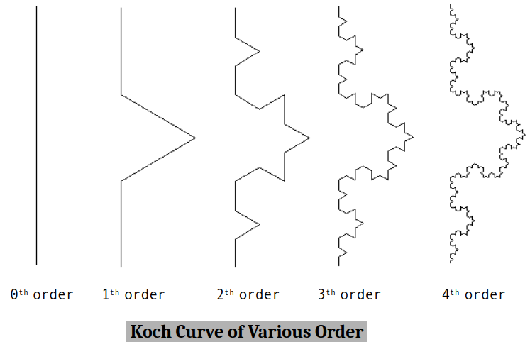

# scan-conversion_ocaml

some cg primitives implemented from ground up

## scan-line algorithm

This is a doc of my implementation of it in [OCaml](./fill_scan-line.ml). This is only capable of filling a triangle but can extended to polygon of arbitrary no. of sides provided edges (meaning which vertices are connected to which) .

Side parallel to $x$ - axis should be handled carefully because inverse of slope, $\frac{1}{m} = \frac{\Delta x}{\Delta y}$ will yield nan as $\Delta y =0 $. But they can drawn simply when scan-line is overlapping it.

Since difference between two consecutive scan-line 

$$\Delta y = y_{c} - y_{p} = 1 $$

Next point of intersection with scan-line with side of polygon can be found 

$$\Rightarrow x_c = x_p + (x_c - x_p) = x_p + \Delta x = x_p + \frac{1}{m} $$ 

where 

$$ y_c \rightarrow current \, scanline $$

$$ y_p \rightarrow previous \, scanline $$

$$ x_c \rightarrow current \, point \, of \, intersection  \, scanline \, with \, side $$

$$ x_p \rightarrow previous \, point \, of \, intersection  \, scanline \, with \, side $$


### algorithm 

Given
- an array of vertices

`let arr = [|(426., 600.); (134., 76.); (720., 76.)|];;`

Records for bunching together all properties we care about in an edge. Here, ymin is smaller of ordinate defining an edge, ymax is bigger of ordinates defining the same edge, x is abcissa of point of intersection of scanline with the side (initially it is set abcissa corresponding to ordinate of ymin), mi is the reciprocal of slope of the edge, a is whether edge is active or not (meaning scanline is intersecting the edge).
```OCaml
type edge = 
{
  ymin : float;
  ymax : float;
  mutable x: float;
  mi   : float;
  mutable a : bool
}
```
Following is helper function which is given to `Array.sort` to sort vertices based on their ordinatate in increasing order.
```OCaml
let cmp a b = 
  if snd a > snd b then 1
  else if snd a < snd b then -1
  else 0
```
For finding reciprocal of slope .
```OCaml
let slope_inv a b =
  (fst a -. fst b) /. (snd a -. snd b)
```
For generating edge (record).
```OCaml
let gen_edge small big = 
  {ymin = snd small; ymax = snd big; x = fst small; mi = slope_inv small big; a = false}
```
For building array of edges given array of vertices.
```OCaml
let edge_arr arr =
  Array.sort cmp arr;
  let edges = ref [] in 
  if snd arr.(1) -. snd arr.(2) <> 0. then
    edges :=  (gen_edge arr.(1) arr.(2)) :: !edges;
  if snd arr.(0) -. snd arr.(2) <> 0. then
    edges :=  (gen_edge arr.(0) arr.(2)) :: !edges;
  if snd arr.(0) -. snd arr.(1) <> 0. then
    edges :=  (gen_edge arr.(0) arr.(1)) :: !edges;
  Array.of_list !edges
```
For activating edges if ymin is equal to scanline. That is when scanline intersects lower vertex of an edge.
```OCaml
let activate_edges l current_scanline =
  for i = 0 to Array.length l -1 do 
    if l.(i).ymin = current_scanline then 
      l.(i).a <- true
  done
```
For deactivating edges if scanline passes upper vertex of an edge.
```OCaml
let deactivate_edges l current_scanline =
  for i = 0 to Array.length l -1 do 
    if l.(i).ymax = current_scanline then 
      l.(i).a <- false
  done
```
For drawing horizontal lines when given abcissas of point of intersection with scanline.
```OCaml
let horizontal_line x1 x2 y =
  for x = truncate (min x1 x2) to truncate (max x1 x2) do 
    plot x (truncate y)
  done
```
For finding out which edges are active and storing their index and updating point of intersection with scanline and drawing horizontal line . We make sure no. of active edges are even because horizontal line can be drawn if two point of abcissas are given.
```OCaml
let process_active l current_scanline =
  let active_indices = ref [] in 
  for i = 0 to Array.length l - 1 do 
    if l.(i).a then
      begin
        active_indices := i :: !active_indices;
        l.(i).x <- l.(i).x +. l.(i).mi
      end
  done;
  let no_of_active = List.length !active_indices in 
  if no_of_active > 0 && no_of_active mod 2 = 0 then 
    begin
      for i = 0 to no_of_active / 2 - 1 do 
        horizontal_line l.(List.nth !active_indices i).x l.(List.nth !active_indices (i + 1)).x current_scanline
      done
    end
```
Finally filling the triangle by iterating through botttom of the screen to top of the screen.
```OCaml
let fill arr =
  let edges = edge_arr arr in 
  for scanline = 0 to size_y ()-1 do 
    activate_edges edges (float scanline);
    deactivate_edges edges (float scanline);
    process_active edges (float scanline);
  done
```

## koch curve



Like [C-curve](./c_curve.pdf), a straight line is also a Koch curve of order 0. For constructing Koch curve of order one more than current one, current is modified as follows:

1. Line is trisected and middle part is removed.
2. Two new line segments are drawn such they make equilateral triangle with removed segment.

Parameters given for constructing Koch curve

1. coordinate of inital point $A(x_1, y_1)$
2. length of initial line $len$ $(= AE)$
3. angle α made by initial line $AE$ with $x-axis$
4. order n of the Koch curve

### preliminaries


For constructing Koch curve, we need more than what we are given, such as coordinates of $B$, $C$, $D$ and $E$ . So need figure those out.

First we find angle made by $BC$ with $x- axis$, i.e, $\beta$.

We know all angles of equilateral triangle is $\frac{\pi}{3}$. And angle made by BD with $x-axis$ is $\alpha$. So

$$\frac{\pi}{3} + \beta = \alpha$$
> $$\beta = \alpha - \frac{\pi}{3}$$

For finding angle made by $CD$ with $x-axis$ ,i.e., $\gamma$ .
We have 

$$ \left(\frac{\pi}{3} - \beta\right) + \gamma = \pi$$

> $$\gamma = \alpha + \frac{\pi}{3}$$

Finally angle made by $DE$ is clearly $\alpha$.

Now, we express coordinate of $B(x_2, x_2)$ in terms of given parameters.

We know 
$$ \cos \alpha = \frac{x_2-x_1}{len/3}$$

> $$x_2 = x_1 + \frac{len}{3} \cos \alpha$$

Similarly,
$$\sin \alpha = \frac{y_2-y_1}{len/3}$$

> $$y_2 = y_1 + \frac{len}{3} \sin \alpha$$

Other results like this can be similarly derived. We just list other needed results.

1. $C(x_3,y_3) \equiv \left(x_2+ \frac{len}{3} \cos \left( \alpha + \frac{\pi}{3}\right), y_2+ \frac{len}{3} \sin \left( \alpha + \frac{\pi}{3}\right) \right)$
2. $D(x_4,y_4) \equiv \left(x_3+ \frac{len}{3} \cos \left( \alpha - \frac{\pi}{3}\right), y_3+ \frac{len}{3} \sin \left( \alpha - \frac{\pi}{3}\right) \right)$
3. $E(x_5,y_5) \equiv \left(x_4+ \frac{len}{3} \cos  \alpha , y_4+ \frac{len}{3} \sin \alpha  \right)$
4. $E(x_5,y_5) \equiv \left(x_1+ len \cos  \alpha , y_1+ len \sin \alpha  \right)$

For finding one coordinate in terms of the other we can use following function.

```OCaml
let transformxy x y len alpha =
  x +. len *. cos alpha, y +. len *. sin alpha
```

### algorithm

Koch-curve ($x \, y \, len \,\alpha \, n$)

1. if $n= 0$ then
    - Draw stright line from A to E

2. if $n>0$ then
    - Koch-curve from A to B reducing order n by 1
    - Koch-curve from B to C reducing order n by 1
    - Koch-curve from C to D reducing order n by 1
    - Koch-curve from D to E reducing order n by 1

Look at the implementaion [here](./koch_curve.ml) .


## sierpinski gasket

It is recursively defined region. To draw it, we need to know coordinates of inital triangle and order of it. 


Only prerequisite is to know that coordinate of a mid point of a line segment (in our case sides of the triangle) is average of coodinates of end points defining the line segment.

For example if $AB$ is a line segment and $M$ is its mid point, where $A \equiv (x_1, y_1)$ and $B \equiv (x_2, y_2)$ .

Then, $M \equiv \left(\frac{x_1 + x_2}{2}, \frac{y_1 + y_2}{2}\right)$

### algorithm


Sierpinski-gasket ($x_1,y_1,x_2,y_2,x_3,y_3, n$)

1. if $n=0$ then 

      - Draw a filled traingle defined by points $A$, $B$ and $C$.
2. if $n > 0$ then 
      - Draw Sierpinski-gasket defined by $A$ , $D$ ,and $F$ reducing order by 1.
      - Draw Sierpinski-gasket defined by $D$ , $B$ ,and $E$ reducing order by 1.
      - Draw Sierpinski-gasket defined by $F$ , $E$ ,and $C$ reducing order by 1.


[Implementaion](sierpinski_gasket.ml)