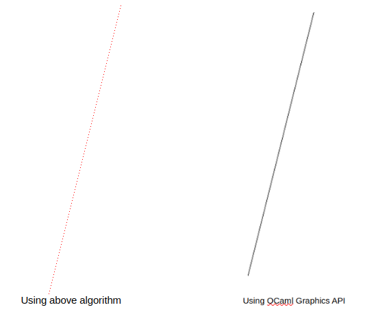

# Basic Rasterizer (in progress)

## barycentric coordinates

These are used when bases are not orthogonal meaning coordinate axes not perpendicular to each other. This especially helpful when express a point's location in terms of vertices of a triangle. 

### **Theorem:** Any point $P$ in the plane of triangle $\triangle ABC$ can be uniquley expressed using three numbers $\alpha$ , $\beta$ and $\gamma$ such that $\alpha + \beta + \gamma = 1$.

### Proof:

We are going to use complex numbers because any point can be represented in argand plane using complex number whose real part represent x-coordinate and imaginary part represent y-coordinate. Most importantly it help to reduce redundancy. 

Let $a$, $b$, $c$ represent vertices of $A$, $B$ and $C$ and $z_P$ is represent any point $P$.

#### Case I: $P$ is in interior of $\triangle ABC$.


Let $k_1 = \frac{PA}{PA'}$ , $k_2 = \frac{A'B}{A'C}$ and $z_a'$ represents $A'$.

Using section formula,

$$z_p = \frac{ PA' a + PA z_a'}{PA' + PA } = \frac{a + \frac{PA}{PA'}z_a'}{1 + \frac{PA}{PA'}} = \frac{a +k_1 z_a'}{1 + k_1}$$ 

Also using section formula,

$$z_{a'} = \frac{A'C b + A'B c} {A'C + A'B} = \frac{b + \frac{A'B}{A'C} c  }{1 + \frac{A'B}{A'C}} = \frac{b + k_2 c}{1 + k_2}$$

Substituting $z_{a'}$ in $z_p$,

$$z_p = \frac{a + k_1 \frac{b + k_2 c}{1 + k_2}}{1 + k_1} = \frac{a}{1 + k_1} + \frac{k_1 b}{(1+k_1)(1+k_2)} + \frac{k_1 k_2 c}{(1+k_1)(1+k_2)}$$

If we consider

- $$\alpha = \frac{1}{1+k_1}$$
- $$\beta = \frac{k_1}{(1+k_1)(1+k_2)}$$
- $$\gamma = \frac{k_1 k_2}{(1+k_1)(1+k_2)}$$

then we have 

$$\alpha + \beta + \gamma = \frac{1}{1+k_1} + \frac{k_1}{(1+k_1)(1+k_2)} + \frac{k_1 k_2}{(1+k_1)(1+k_2)} = 1$$

Therefore,

$$ z_p = \alpha a + \beta b + \gamma c$$

such that $\alpha + \beta + \gamma = 1$

#### Case II: $P$ is outside the $\triangle ABC$.


Let $k_3 = \frac{B'A}{B'C}$ , $k_4 = \frac{B'P}{BP}$ and $z_{b'}$ represents $B'$.

Using section formula, 

$$ z_{b'} = \frac{B'C a + B'A c}{B'C + B'A} = \frac{a + \frac{B'A}{B'C}c}{1 + \frac{B'A}{B'C}} = \frac{a + k_3 c}{1 + k_3}$$

Similarly,

$$ z_p = \frac{BP z_{b'} - B'P b}{BP - B'P} = \frac{z_{b'}- \frac{B'P}{BP}b}{1 - \frac{B'P}{BP}} = \frac{z_{b'} - k_4 b}{1 - k_4}$$

Substituting $z_{b'}$ in $z_p$,

$$z_p = \frac{\frac{a+ k_3 c}{1 + k_3} - k_4 b}{1 - k_4} =  \frac{1}{(1+ k_3)(1 - k_4)} \times a + \frac{k_3}{(1+ k_3)(1- k_4)} \times c - \frac{k_4 (1+ k_3)}{(1- k_4)(1 + k_3)} \times b$$

Lets consider

- $$\alpha = \frac{1}{(1+ k_3)(1 - k_4)}$$
- $$\beta = - \frac{k_4 (1+ k_3)}{(1- k_4)(1 + k_3)}$$
- $$\gamma =  \frac{k_3}{(1+ k_3)(1- k_4)}$$

then we have

$$\alpha + \beta + \gamma = 1 $$

This case is proved too.

#### Case III: $P$ is on the edge of the $\triangle ABC$.


Let $k = \frac{PA}{PB}$ and $z_p$ represent point $P$ on the edge.

Using section formula,

$$z_p = \frac{PB a + PA b}{PA + PB} = \frac{a + \frac{PA}{PB}b}{1 + \frac{PA}{PB}} = \frac{a + kb}{1 +k} = \frac{1}{1 + k} a + \frac{k}{1+k} b + 0 c$$

Consider 

- $$\alpha = \frac{1}{1 + k}$$
- $$\beta = \frac{k}{1+k}$$
- $$\gamma = 0$$

then we have 

$$\alpha + \beta + \gamma = 1 $$

This covers all possible cases and also the proof. $\square$

## very simple line 

Although there are advanced routine for drawing lines like Bresenham, we are going to use quick and dirty approach to draw line. But this function fails for vertical lines for obvious reasons (infinite slope of vertical lines).

We know 

$$ y = mx + c$$

All symbols have their usual meaning.

Since we are drawing lines in 2D plane, let us represent the end points as $A(x_0 , y_0)$ and $B(x_1, y_1)$.
Without loss of generality, we assume $A$ 's abcissa is smaller than the $B$.
We know that cooodinates of pixels are discrete and can take only integer values, this fact can be exploited to perform integer arithmetic mostly and floating point computation once for calculating slope.

Now,

$$ m = \frac{y_1 - y_0}{x_1 - x_0}$$

To find $x_n$ abcissa of next point from $x_c$ current abcissa,

$$x_n = x_c + 1$$

Then, $y_n$ ordinate of next point in terms of $y_c$ current ordinate

$$ y_n = mx_n + c = m(x_c +1) + c = mx_c + m + c = y_c + m $$

$$ \because y_c = mx_c + c$$

Traslating this into code

```OCaml
(* shifting origin to center of graphics window and setting color *)
let plotc x' y' color =
  let x,y =  x' + (size_x ()) / 2, y' + (size_y ()) / 2 in 
  set_color color;
  plot x y
```

```OCaml
(* increments smaller abcissa till it reachs bigger abcissa *)
(* to find subsequent ordinate - inital ordinate + slope *)
let rec draw_line_inner {x = x0;y = y0} {x = x1;y = y1} slope color =
  if x0 = x1 then ()
  else 
    begin
      plotc x0 y0 color;
      draw_line_inner {x = x0+1;y = y0+slope} {x = x1;y = y1} slope color
    end

(* wrapper function *)
(* passes slope and interchanges points so that first point has smaller abcissa compared to second's*)
let draw_line (x0,y0) (x1,y1) color = 
  if x0 > x1 then 
    draw_line_inner {x = x1;y = y1} {x = x0;y = y0} (truncate (float (y1 - y0) /. float (x1 - x0))) color
  else
    draw_line_inner {x = x0;y = y0} {x = x1;y = y1} (truncate (float (y1 - y0) /. float (x1 - x0))) color
```
### Comparision


Clearly, there are gaps between consective points on the line. These gaps gets bigger as the line gets steeper.
One of the reasons that it does that is because sometimes we need more $y$ values for corespponding $x$ value. Extreme example of this is vertical line - we need lots of $y$ values corresponding to single $x$ values.

## linear interpolation

We are given two ordered pairs (i.e. 2D points) where one element of each pair is independent and the other one is dependent on it and we have to generate more ordered pairs such that joining them makes a straight line.

We will use the same idea as used previously in drawing line, instead of $x$'s and $y$'s we have $i$'s and $d$'s (which symbolically denotes indpendent and dependent variable respectively) and instead of drawing immediately we will instead store it in a list and finally return it.

Implementation looks like this:

```OCaml
(* to generate a list of dependents d corresponding to independents i between i0 and i1 *)
(* m is the slope *)
(* ld is the list of dependents *)
let rec interpolate_inner i0 d i1 m ld =
  if i0 = i1 then ld else interpolate_inner (i0 +. 1.) (d+.m)  i1 m ((d+.m) :: ld)

(* wrapper function *)
let interpolate i0 d0 i1 d1 = 
  if i0 > i1 then [d0]
    else 
      (  let m = (d1 -. d0) /. (i1 -. i0) in
      interpolate_inner i0 d0 i1 m [] )
```

## line

We use same algorithm as before but employ interpolate function to treat $x$ and $y$ as dependent or independent based on slope $m$.

If $ | m | > 1$ then $y + m$ will be farther apart than previous ordinate $y$ which will result in gap while drawing. In this case we treat $x$ as dependent and $y$ as independent.

If $|m| < 1$ then we follow usual approach as used in [previous line drawing algorithm](#very-simple-line).

```OCaml
(* helper function for plotting points of list based on whether x is independent or y  *)
let rec draw_inner i0 ld color w =
  match ld, w with 
  h::t , 'x'-> plotc i0 h color; draw_inner (i0-.1.)  t color w
  | h::t , 'y'-> plotc h i0 color; draw_inner (i0-.1.)  t color w
  | _ -> ()

let draw_line {x=x0;y=y0} {x=x1;y=y1} color =
  if abs_float (x1 -. x0) > abs_float (y1 -. y0) then
    (* line makes angle of less than 45 with horizontal axis *)
    begin
      if x0 < x1 then 
        (let ly = interpolate x0 y0 x1 y1 in 
        draw_inner x1 ly color 'x')
      else
        (let ly = interpolate x1 y1 x0 y0 in 
        draw_inner x0 ly color 'x')
    end
  else
    (* line makes angle of 45 or more with horizontal axis *)
    begin
      if y0 < y1 then 
        (let lx = interpolate y0 x0 y1 x1 in 
        draw_inner y1 lx color 'y')
      else
        (let lx = interpolate y1 x1 y0 x0 in 
        draw_inner y0 lx color 'y')
    end
```
## filled triangle

We use the same basic idea as in [scan-line algorithm](./../README.md) but the code organization is different. One of the major difference is that we calculate end points of horizontal line that needs to be drawn in one go using `interpolate`, instead of calulating them on the fly.

Here's outline of algorithm:

1. Sort the three points based on the ordinates in ascending order.
2. Calculate abcissas of of longest side using interpolate.
3. Also do same for other two sides. Delete common abcissa and merge the list.
4. Find the which list contains abcissas on left side. 
5. Iterate through lowest ordinate to highest ordinate and draw horizontal line from left side abcissa to right side abcissa.

