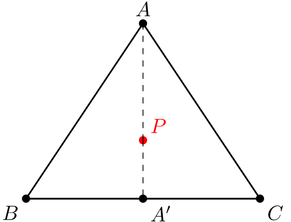
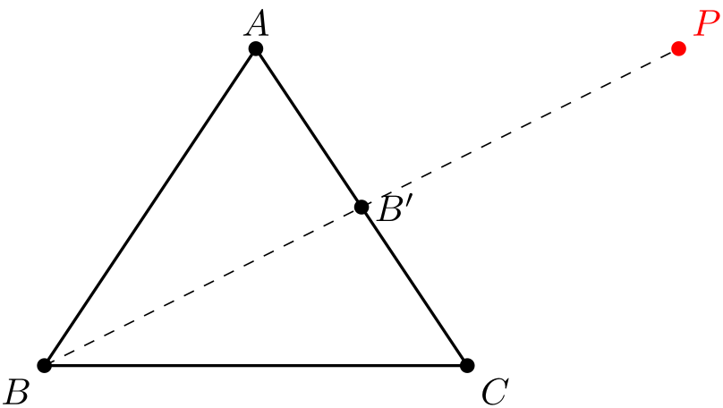
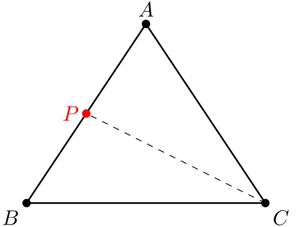

# Basic Rasterizer (in progress)

## barycentric coordinates

These are used when bases are not orthogonal meaning coordinate axes not perpendicular to each other. This especially helpful when express a point's location in terms of vertices of a triangle. 

### **Theorem:** Any point $P$ in the plane of triangle $\triangle ABC$ can be uniquley expressed using three numbers $\alpha$ , $\beta$ and $\gamma$ such that $\alpha + \beta + \gamma = 1$.

### Proof:

We are going to use complex numbers because any point can be represented in argand plane using complex number whose real part represent x-coordinate and imaginary part represent y-coordinate. Most importantly it help to reduce redundancy. 

Let $a$, $b$, $c$ represent vertices of $A$, $B$ and $C$ and $z_P$ is represent any point $P$.

#### Case I: $P$ is in interior of $\triangle ABC$.

Let $k_1 = \frac{PA}{PA'}$ , $k_2 = \frac{A'B}{A'C}$ and $z_a'$ represents $A'$.

Using section formula,

$$z_p = \frac{ PA' a + PA z_a'}{PA' + PA } = \frac{a + \frac{PA}{PA'}z_a'}{1 + \frac{PA}{PA'}} = \frac{a +k_1 z_a'}{1 + k_1}$$ 

Also using section formula,

$$z_{a'} = \frac{A'C b + A'B c} {A'C + A'B} = \frac{b + \frac{A'B}{A'C} c  }{1 + \frac{A'B}{A'C}} = \frac{b + k_2 c}{1 + k_2}$$

Substituting $z_{a'}$ in $z_p$,

$$z_p = \frac{a + k_1 \frac{b + k_2 c}{1 + k_2}}{1 + k_1} = \frac{a}{1 + k_1} + \frac{k_1 b}{(1+k_1)(1+k_2)} + \frac{k_1 k_2 c}{(1+k_1)(1+k_2)}$$

If we consider

- $$\alpha = \frac{1}{1+k_1}$$
- $$\beta = \frac{k_1}{(1+k_1)(1+k_2)}$$
- $$\gamma = \frac{k_1 k_2}{(1+k_1)(1+k_2)}$$

then we have 

$$\alpha + \beta + \gamma = \frac{1}{1+k_1} + \frac{k_1}{(1+k_1)(1+k_2)} + \frac{k_1 k_2}{(1+k_1)(1+k_2)} = 1$$

Therefore,

$$ z_p = \alpha a + \beta b + \gamma c$$

such that $\alpha + \beta + \gamma = 1$

#### Case II: $P$ is outside the $\triangle ABC$.

Let $k_3 = \frac{B'A}{B'C}$ , $k_4 = \frac{B'P}{BP}$ and $z_{b'}$ represents $B'$.

Using section formula, 

$$ z_{b'} = \frac{B'C a + B'A c}{B'C + B'A} = \frac{a + \frac{B'A}{B'C}c}{1 + \frac{B'A}{B'C}} = \frac{a + k_3 c}{1 + k_3}$$

Similarly,

$$ z_p = \frac{BP z_{b'} - B'P b}{BP - B'P} = \frac{z_{b'}- \frac{B'P}{BP}b}{1 - \frac{B'P}{BP}} = \frac{z_{b'} - k_4 b}{1 - k_4}$$

Substituting $z_{b'}$ in $z_p$,

$$z_p = \frac{\frac{a+ k_3 c}{1 + k_3} - k_4 b}{1 - k_4} =  \frac{1}{(1+ k_3)(1 - k_4)} \times a + \frac{k_3}{(1+ k_3)(1- k_4)} \times c - \frac{k_4 (1+ k_3)}{(1- k_4)(1 + k_3)} \times b$$

Lets consider

- $$\alpha = \frac{1}{(1+ k_3)(1 - k_4)}$$
- $$\beta = - \frac{k_4 (1+ k_3)}{(1- k_4)(1 + k_3)}$$
- $$\gamma =  \frac{k_3}{(1+ k_3)(1- k_4)}$$

then we have

$$\alpha + \beta + \gamma = 1 $$

This case is proved too.

#### Case III: $P$ is on the edge of the $\triangle ABC$.

Let $k = \frac{PA}{PB}$ and $z_p$ represent point $P$ on the edge.

Using section formula,

$$Z_p = \frac{PB a + PA b}{PA + PB} = \frac{a + \frac{PA}{PB}b}{1 + \frac{PA}{PB}} = \frac{a + kb}{1 +k} = \frac{1}{1 + k} a + \frac{k}{1+k} b + 0 c$$

Consider 

- $$\alpha = \frac{1}{1 + k}$$
- $$\beta = \frac{k}{1+k}$$
- $$\gamma = 0$$

then we have 

$$\alpha + \beta + \gamma = 1 $$

This covers all possible cases and also the proof. $\square$