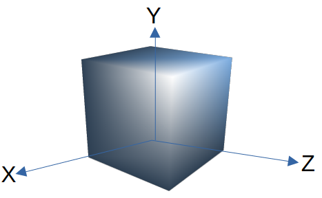

# Very Basic Ray tracer (in progress)

## coordinate system

In OCaml standard graphics library, origin of drawing window is situated at bottom left corner of it. For convenience we want it in middle of the window. So we need wrapper function 

```Ocaml
let plotc x' y' color =
    let x,y = x + size_x() / 2, y + size_y / 2 in 
    set_color (rgb color);
    plot x y;;
```
It translates origin to middle of the graphics window.

## colors

We use additive color model (RGB model), obviously.
With each color channel represented by 8 bit positive integer. So, range is [0,255]. We can treat triplet of RGB values as a vector. Then, adding two colors together we get new color. And mutiplying a color by scalar just increases brightness , i.e.

$$k (r, g, b) = (kr, kg, kb) $$

There is a chance that any of channel value goes out of range [0,255], while manipulating colors. We can handle this as follows:

Suppose there is channel value $x$
- If $x > 255 $,
 then we set $x = 255$
- If $x <0$ then we set $x = 0$ 

This is called **clamping**.

## scene

The scene is simply set of objects that we want render on the screen.

For representing objects in a scene, we need use 3D coordinate system which uses real numbers to represent  continous values, then map that to discrete 2D graphics window while drawing.



It's clear from figure which axes point in which direction.

Viewing position from where we look at the scene is called **camera position**. We assume that camera is fixed and occupies single point in space which often will be origin $O(0,0,0)$. 

**Camera orientation** is the direction in which camera points, or from where rays enter the camera. We will assume camera orientation to be $Z_+$, positive z axis. 

Frame, which is actualy graphics window where 3D scene get mapped to 2D, has dimension $V_w$ and $V_h$ and is frontal to camera (perpendicular to camera orientation irrespective of camera position, in our case perpendicular to $Z_+$ ) and $d$ distance away from camera.
Technically, it's called **viewport**.

Angle visible from *camera* is called **field of view** (FOV). It depends on distance $d$ from camera to viewport and dimensions of viewport $V_w$ and $V_h$. 

In our case, we assume 
$$V_w = V_h = d = 1 \implies FOV \approx 53 \degree$$ 

We will represent coordinate of viewport as $(V_x,V_y)$ in worldly units and graphics window as $(G_x,G_y)$ in pixels.
So conversion is 
$$G_x = V_x \times \frac{G_w}{V_w}$$
$$G_y = V_y \times \frac{G_h}{V_h}$$

where $G_w$ and $G_h$ are maximum width and height of graphics window, respectively.

But we know that viewport is in the 3D space, so it also has $V_z = d$ for every point on this viewport (in math term called *projection plane*).

So, for every pixel  $(G_x, G_y)$ on graphics window we can calculate the corresponding $(V_x,V_y,V_z)$ of viewport.

## rays

The rays are just the straight lines emanating from origin $O$ and passing through various point of viewport and finally intersecting the objects of the scene.

We will represent straight line using parametric form as 

$$P = O + t(V-O) $$

Here
- $P$ is any point on the line
- $O$ is the origin (where camera is positioned)
- $V$ is any pint on the viewport
- $t$ is the parameter, $-\infty < t < \infty$ 

We vary $t$ to get various point on the straigh line.

## sphere 

It is the simplest geometric object and will use as a object of the scene.

We represent sphere as 

$$\langle P - C, P - C  \rangle = r^2 $$

Here
- P is point on the surface of sphere
- C is the center of the sphere
- r is the radius of the sphere