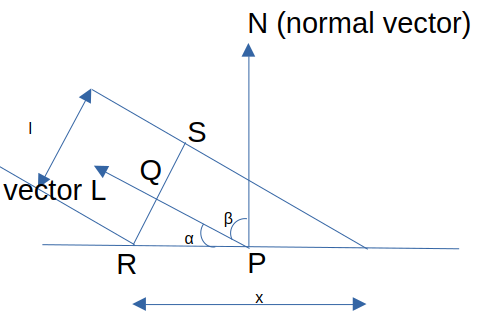

# Very Basic Ray Tracer (in progress)

## coordinate system

In OCaml standard graphics library, origin of drawing window is situated at bottom left corner of it. For convenience we want it in middle of the window. So we need wrapper function 

```Ocaml
let plotc x' y' color =
    let x,y = x' + (size_x ()) / 2, y' + (size_y ()) / 2 in 
    set_color (rgb color);
    plot x y;;
```
It translates origin to middle of the graphics window.

## colors

We use additive color model (RGB model), obviously.
With each color channel represented by 8 bit positive integer. So, range is [0,255]. We can treat triplet of RGB values as a vector. Then, adding two colors together we get new color. And multiplying a color by scalar just increases brightness , i.e.

$$k (r, g, b) = (kr, kg, kb) $$

There is a chance that any of channel value goes out of range [0,255], while manipulating colors. We can handle this as follows:

Suppose there is channel value $x$
- If $x > 255 $,
 then we set $x = 255$
- If $x <0$ then we set $x = 0$ 

This is called **clamping**.

## scene

The scene is simply set of objects that we want render on the screen.

For representing objects in a scene, we need use 3D coordinate system which uses real numbers to represent  continous values, then map that to discrete 2D graphics window while drawing.


It's clear from figure which axes point in which direction.

Viewing position from where we look at the scene is called **camera position**. We assume that camera is fixed and occupies single point in space which often will be origin $O(0,0,0)$. 

**Camera orientation** is the direction in which camera points, or from where rays enter the camera. We will assume camera orientation to be $Z_+$, positive z axis. 

Frame has dimension $V_w$ and $V_h$ and is frontal to camera (perpendicular to camera orientation irrespective of camera position, in our case perpendicular to $Z_+$ ) and $d$ distance away from camera.
Technically, it's called **viewport**.

Angle visible from *camera* is called **field of view** (FOV). It depends on distance $d$ from camera to viewport and dimensions of viewport $V_w$ and $V_h$. 

In our case, we assume 

$$V_w = V_h = d = 1 \implies FOV \approx 53 \degree$$ 

We will represent coordinate of viewport as $(V_x,V_y)$ in worldly units and graphics window as $(G_x,G_y)$ in pixels.
So conversion is 

$$V_x = G_x \times \frac{V_w}{G_w}$$

$$V_y = G_y \times \frac{V_h}{G_h}$$

where $G_w$ and $G_h$ are maximum width and height of graphics window, respectively.

```OCaml
let g_to_viewport gx gy =
    let vw = 1. in (* setting width and height of viewport *)
    let vh = 1. in
    let vx = (float gx) .* vw /. float (size_x ()) in 
    let vy = (float gy) .* vh /. float (size_y ()) in 
    let d = 1 in (* z coordinate of viewport *)
    vx, vy, d;;
```

But we know that viewport is in the 3D space, so it also has $V_z = d$ for every point on this viewport (in math term called *projection plane*).

So, for every pixel  $(G_x, G_y)$ on graphics window we can calculate the corresponding $(V_x,V_y,V_z)$ of viewport.

## rays

The rays are just the straight lines emanating from origin $O$ and passing through various point of viewport and finally intersecting the objects of the scene.

We will represent straight line using parametric form as 

$$P = O + t(V-O) $$

Here
- $P$ is any point on the line
- $O$ is the origin (where camera is positioned)
- $V$ is any point on the viewport
- $t$ is the parameter, $-\infty < t < \infty$ 

We vary $t$ to get various point on the straight line.

Also note that
- $t < 0$, then $P$ is behind the camera
- $0 \leq t \leq 1$ , then $P$ lies between camera and viewport
- $ t > 1 $ , then $P$ is in front of viewport 

## sphere 

It is the simplest geometric object and will use as a object of the scene.

We represent sphere as 

$$\langle P - C, P - C  \rangle = r^2 $$

Here
- P is point on the surface of sphere
- C is the center of the sphere
- r is the radius of the sphere

## rays intersect objects in scene

Currently, we just have sphere.

### intersection of straight line and sphere

Let $P$ be point of intersection then it is common point to both ray and sphere.

Equation of ray is 

$$P = O + t \vec{D} $$

where $ \vec{D} = V - O $ is the direction of ray

Equation of sphere is

$$ \langle P - C, P - C  \rangle = r^2 $$

So we can substitute value of $P$ in equation of sphere we get

(Before we get into calculation, we need remmember that, for vectors defined over real numbers, $ \langle \vec{a}, \vec{b} \rangle = \langle \vec{b}, \vec{a} \rangle $ . In general case, one would be complex conjugate of the other. )

$$ \langle O + t \vec{D} - C , O + t \vec{D} - C \rangle = r^2 $$

$$\langle t \vec{D} + \vec{CO}, t \vec{D} + \vec{CO} \rangle = r^2 $$

$$\langle t \vec{D} + \vec{CO}, t \vec{D} \rangle + \langle t \vec{D} + \vec{CO}, \vec{CO} \rangle= r^2 
$$

$$ \langle t \vec{D}, t \vec{D} \rangle + \langle t \vec{D} , \vec{CO} \rangle + \langle \vec{CO} , t \vec{D} \rangle + \langle \vec{CO} , \vec{CO} \rangle= r^2 $$

Finally

$$at^2 + bt + c = 0 $$

where 
- $ a = \| \vec{D} \| $
- $ b = 2 \langle \vec{D}, \vec{CO} \rangle $
- $ c = \| \vec{CO} \| - r^2 $

This makes sense because ray can intersect a sphere either at 0, 1 or 2 points.

We can now find value of $t$ from same old quadratic formula.

$$ t_{1,2} = \frac{-b \pm \sqrt{b^2-4ac}}{2a} $$

After finding value of $t$ we can substitute in equation of ray to find point $P$. We should be careful to take  closest point $P$ (the one which is visible to camera) and for which $t > 1$ (objects are in front of viewport).

## lighting

We use white light and assume that light has same intensity irrespective of distance from the source.

### point lights

They can completely be described by 

- coordinate $Q$ of their location 
- intensity of light

Any vector from arbitrary point $P$ to light source $Q$ will be denoted by $\vec{L}$ .

### directional lights

They are used for representing light sources that are situated very far away compared to distances between objects in the scene. So, rays of light coming from these sources are essentially parallel with each other. So, $\vec{L}$ is same for every point $P$ in the scene.

To model these lights we need

- direction vector $\vec{L}$
- intensity of light

### ambient light

In real life, an object that does not get direct light is not completely dark because reflected light illuminates it. In order to avoid treating every object as a light source, we will use ambient light which basically illuminates every object in the scene.

To model it we need

- intensity of light 

### lighting a point
```OCaml
(* type for light *)
(* kind of light is represented by k field - *)
(* p - for point source *)
(* d - for directional light *)
(* a - for ambient source *)
type light = 
  {
    k : char;
    i : float;
    v : point option
  }
```
v stores

- location of point, in case of point source
- direction vector, in case of directional light
- `None` , in case of ambient source

Some of all intensities of light should equal to 1. Because if it didn't then some of points in scene will overexposed.

Now calculate how much a point should illuminated by a point source and directional source.

Consider a point $P$ in the scene. $\vec{N}$ is a normal vector from $P$. $\vec{L}$ is directional vector. In case of directional light, we are already given. But in case, point light source we need to compute it from position of light source and coordinate of point $P$. $l $ denote  width of the light (proportional to intensity) and $x$ denotes length over which light spreads. $RS$ is perpendicular to $\vec{L}$ and $Q$ is point of intersection.

$\frac{l}{x}$ represent drop in the intensity after reflection of light. For example, if light is perpendicular to point $P$ of the surface, $\frac{l}{x} = 1$ . 



Consider $\triangle PQR$ which is a right angled triangle.

It is easy to see that 

$$\angle PRQ = \beta $$

Now,

$$\cos \beta = \frac{l/2}{x/2} = \frac{l}{x}$$

We know that

$$\langle \vec{L}, \vec{N}\rangle = ||\vec{L}||   ||\vec{N}|| \cos \beta$$

So,

$$\cos \beta = \frac{\langle \vec{L}, \vec{N}\rangle}{||\vec{L}||   ||\vec{N}||}$$

If $\beta > 90 \degree$ then point is illuminated from back side of surface. In that case, we treat it as zero.

We will multiply intensity of light by this factor $\cos \beta$ to get intensity after reflection.


A single point in a scene is illuminated by many sources which may be of different kind.

We simply add all the light's intensity which hits the point and finally multiply total intensity by color of the point. It basically increases or decreases the brightness.

Mathematically,

$$I_{total} = I_a + \sum I_i \frac{\langle \vec{L_i}, \vec{N}\rangle}{||\vec{L}_i||   ||\vec{N}||}$$

where 

- $I_{total}$ is the total intensity
- $I_a$ is the intensity of ambient source
- $I_i$ is intensity of $i$ th light source which can be point source or directional light
- $L_i$ is directional vector of light


## rendering

We iterate over every pixels of graphics window and find corresponding point on the viewport and shoot out a ray from camera through that point on viewport. If that ray intersect an object in the scene then we calculate the color and then set that pixel to that color.

```OCaml
let o = (0,0,0);; (* the origin O*)
let gw, gh = size_x (), size_y ();; (*max width and height of graphics window *)
for x = -gw/2 to gw/2 do 
    for y = -gh/2 to gh/2 do 
        let v = g_to_viewport x y in
        let color = rtx o v 1. infinity ls (ref None)  (ref (Some infinity)) in 
        plotc x y color
    done;
done;;
```